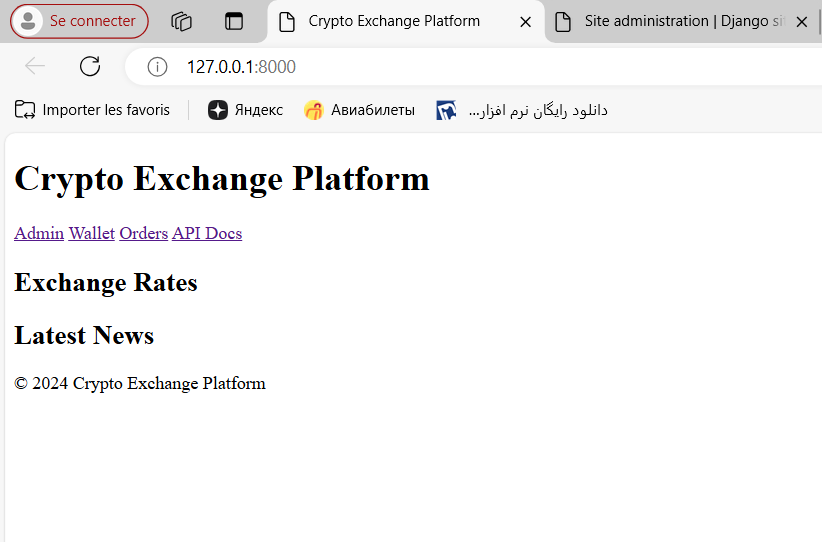
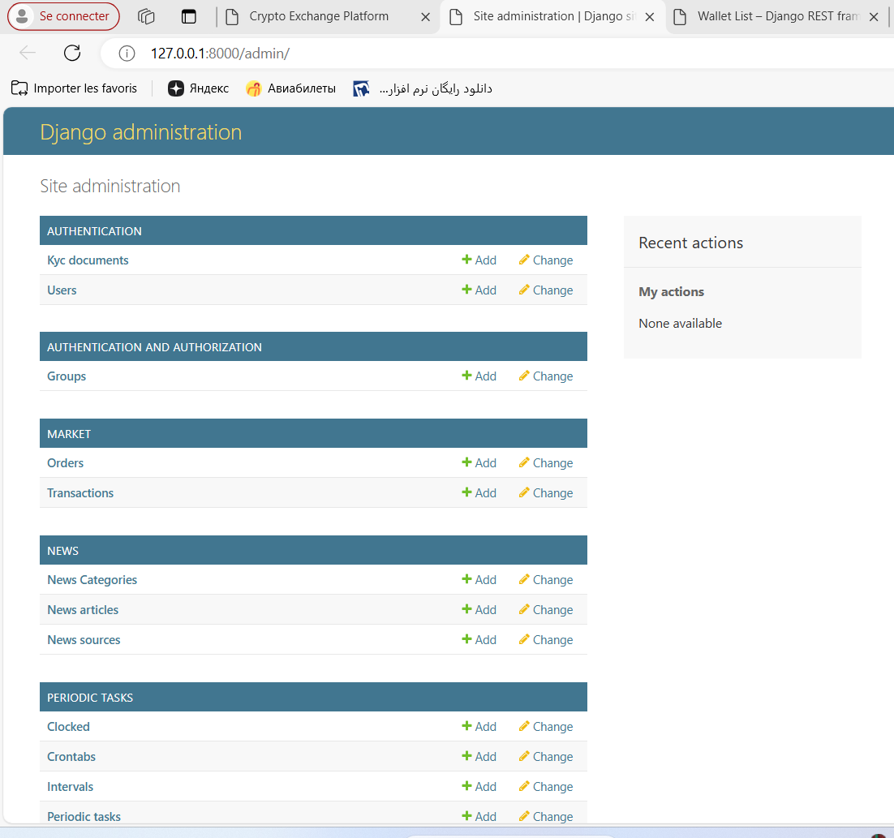

# Crypto Exchange Platform

A cryptocurrency exchange platform with advanced features, including real-time exchange rates, an OTC (Over-the-Counter) market, wallet management, and a secure verification process.

---

## Platform Architecture and Functional Modules

### Homepage
- **Real-Time Exchange Rates**: Display exchange rate trends between various national currencies and cryptocurrencies.
- **News Section**: Integrates the latest cryptocurrency news from various sources, providing links and summaries for quick access to market updates.

### OTC Market Trading List
- **Active Orders**: Shows all active buy and sell orders.
- **Buy Orders**: Users can view all orders selling cryptocurrencies.
- **Sell Orders**: Users can view all demand orders to buy cryptocurrencies.
- **Initiating Trades**: Users can click on any order to view detailed information and proceed with transactions.

### Personal Homepage (Wallet Information)
- **Balance Display**: Shows the user's account balance on the platform.
- **Transaction History**: Lists all historical transactions of the user, with filters to view bought or sold orders.
- **Transaction Security Code**: Users set and manage their own transaction security code for transaction confirmation.
- **Customer Service Window**: Provides instant help to resolve any platform-related issues.

---

## Development and Deployment Workflow

### Local Setup Options
You can set up the project locally using either **Docker** (recommended for consistent environments) or manual Python commands.

---

### Using Docker

#### Prerequisites:
1. Install **Docker** and **Docker Compose**.
2. Clone the repository:
   ```bash
   git clone https://github.com/username/project.git
   cd project
   ```

#### Steps:
1. Create an `.env` file from the example:
   ```bash
   cp .env.example .env
   ```
   Update the file with the necessary settings (e.g., database credentials, secret keys).

2. Build and run containers:
   ```bash
   docker-compose up --build
   ```

3. Apply database migrations and load initial data:
   ```bash
   docker-compose exec web python manage.py migrate
   docker-compose exec web python manage.py loaddata initial_data.json
   ```

4. Create a superuser:
   ```bash
   docker-compose exec web python manage.py createsuperuser
   ```

5. Access the application:
   - Backend: [http://localhost:8000](http://localhost:8000)
   - Swagger Docs: [http://localhost:8000/swagger/](http://localhost:8000/swagger/)

---

### Using Python Locally (Without Docker)

#### Prerequisites:
1. Install Python 3.9+ and PostgreSQL.
2. Set up a virtual environment:
   ```bash
   python -m venv venv
   source venv/bin/activate  # On Windows, use venv\Scripts\activate
   ```

#### Steps:
1. Clone the repository:
   ```bash
   git clone https://github.com/username/project.git
   cd project
   ```

2. Install dependencies:
   ```bash
   pip install -r requirements.txt
   ```

3. Set up environment variables:
   ```bash
   cp .env.example .env
   ```
   Update the file with the required settings.

4. Apply migrations and create a superuser:
   ```bash
   python manage.py migrate
   python manage.py createsuperuser
   ```

5. Run the development server:
   ```bash
   python manage.py runserver
   ```

6. Access the application:
   - Backend: [http://127.0.0.1:8000](http://127.0.0.1:8000)
   - Swagger Docs: [http://127.0.0.1:8000/swagger/](http://127.0.0.1:8000/swagger/)

---

## Testing the Application

### Using Docker:
1. Run all tests:
   ```bash
   docker-compose exec web python manage.py test
   ```

2. Check test coverage:
   ```bash
   docker-compose exec web coverage run manage.py test
   docker-compose exec web coverage report
   ```

### Using Python Locally:
1. Run all tests:
   ```bash
   python manage.py test
   ```

2. Run tests for specific apps:
   ```bash
   python manage.py test authentication
   python manage.py test wallet
   ```

3. Generate test coverage report:
   ```bash
   coverage run manage.py test
   coverage report
   coverage html  # Generates an HTML report
   ```

---

## Production Deployment

### Using Docker (Recommended):
1. Secure environment variables with a service like AWS Secrets Manager or create a secure `.env` file.
2. Update `docker-compose.prod.yml` for production settings.
3. Deploy the application:
   ```bash
   docker-compose -f docker-compose.prod.yml up --build
   ```

---

## Features

- **WebSocket**: Real-time updates for exchange rates.
- **Swagger/OpenAPI**: Interactive API documentation.
- **Email Notifications**: Alerts and notifications for user activities.
- **Security**: JWT-based authentication and transaction security code.

---

## Support
For questions or assistance, contact [tatyoko28@gmail.com](mailto:tatyoko28@gmail.com).


---

## Screenshots



<!-- ... autres images ... -->

---
