# Crypto Exchange Platform

A cryptocurrency exchange platform with advanced features, including real-time exchange rates, an OTC (Over-the-Counter) market, wallet management, and a secure verification process.

---

## Platform Architecture and Functional Modules

### Homepage
- **Real-Time Exchange Rates**: Display exchange rate trends between various national currencies and cryptocurrencies.
- **News Section**: Integrates the latest cryptocurrency news from various sources, providing links and summaries for quick access to market updates.

### OTC Market Trading List
- **Active Orders**: Shows all active buy and sell orders.
- **Buy Orders**: Users can view all orders selling cryptocurrencies.
- **Sell Orders**: Users can view all demand orders to buy cryptocurrencies.
- **Initiating Trades**: Users can click on any order to view detailed information and proceed with transactions.

### Personal Homepage (Wallet Information)
- **Balance Display**: Shows the user's account balance on the platform.
- **Transaction History**: Lists all historical transactions of the user, with filters to view bought or sold orders.
- **Transaction Security Code**: Users set and manage their own transaction security code for transaction confirmation.
- **Customer Service Window**: Provides instant help to resolve any platform-related issues.

---

## Development and Deployment Workflow

### Local Setup Options
You can set up the project locally using either **Docker** (recommended for consistent environments) or manual Python commands.

---

### Using Docker

#### Prerequisites:
1. Install **Docker** and **Docker Compose**.
2. Clone the repository:
   ```bash
   git clone https://github.com/username/project.git
   cd project
   ```

#### Database Configuration:
Before starting, ensure your database settings are correctly configured:
1. Check the database settings in `.env.docker`:
   - POSTGRES_DB
   - POSTGRES_USER
   - POSTGRES_PASSWORD
   - POSTGRES_HOST
   - POSTGRES_PORT

2. If you need to modify these settings, update them in:
   - `.env.docker` for Docker environment
   - `.env.local` for local development
   - `docker-compose.yml` (ensure the database service configuration matches)

Note: If you change database credentials, ensure they match across all configuration files.

#### Steps:
1. For Docker, copy `.env.docker` to `.env`:
   ```bash
   cp .env.docker .env
   ```

2. Start the containers:
   ```bash
   docker-compose down -v  # Clean start by removing volumes
   docker-compose up -d --build  # Build and start containers in detached mode
   ```

3. Verify containers are running:
   ```bash
   docker-compose ps  # All containers should show status "running"
   ```

4. Wait for the database to be ready:
   ```bash
   docker-compose logs db  # Check if PostgreSQL is ready to accept connections
   ```

5. Apply migrations in the correct order:
   ```bash
   # First, apply Django's default migrations
   docker-compose exec web python manage.py migrate auth
   docker-compose exec web python manage.py migrate contenttypes
   docker-compose exec web python manage.py migrate admin
   docker-compose exec web python manage.py migrate sessions

   # Then, apply third-party app migrations
   docker-compose exec web python manage.py migrate django_celery_beat

   # Finally, apply all project app migrations
   docker-compose exec web python manage.py migrate authentication
   docker-compose exec web python manage.py migrate wallet
   docker-compose exec web python manage.py migrate market
   docker-compose exec web python manage.py migrate news
   docker-compose exec web python manage.py migrate rates
   docker-compose exec web python manage.py migrate support

   # Alternative: apply all migrations at once
   docker-compose exec web python manage.py migrate
   ```

   # Then, check that the tables are created correctly
   ```
   docker-compose exec db psql -U postgres -d crypto_exchange_1 -c '\dt'
   ```


6. Create a superuser:
   ```bash
   # First, ensure the database is ready and migrations are applied
   docker-compose logs db  # Verify database is running
   docker-compose exec db psql -U postgres -d crypto_exchange_1 -c '\dt'  # Verify tables exist
   
   # Then create the superuser
   docker-compose exec web python manage.py createsuperuser
   ```

7. Access the application:
   - Backend: [http://localhost:8000](http://localhost:8000)
   - Swagger Docs: [http://localhost:8000/swagger/](http://localhost:8000/swagger/)

---

#### To stop the application later
```bash
docker-compose down
```

#### To restart it quickly next time

```bash
docker-compose down
docker-compose up -d
```


### Using Python Locally (Without Docker)

#### Prerequisites:
1. Install Python 3.9+ and PostgreSQL.
2. Set up a virtual environment:
   ```bash
   python -m venv venv
   source venv/bin/activate  # On Windows, use venv\Scripts\activate
   ```

#### Steps:
1. Clone the repository:
   ```bash
   git clone https://github.com/username/project.git
   cd project
   ```

2. For local development, copy `.env.local` to `.env`:
   ```bash
   cp .env.local .env
   ```
   Note: This configuration uses "localhost" as PostgreSQL host for local development.

3. Install dependencies:
   ```bash
   pip install -r requirements.txt
   ```

4. Apply migrations and create a superuser:
   ```bash
   python manage.py migrate
   python manage.py createsuperuser
   ```

5. Run the development server:
   ```bash
   python manage.py runserver
   ```

6. Access the application:
   - Backend: [http://127.0.0.1:8000](http://127.0.0.1:8000)
   - Swagger Docs: [http://127.0.0.1:8000/swagger/](http://127.0.0.1:8000/swagger/)

---

## Testing the Application

### Using Docker:
1. Run all tests:
   ```bash
   docker-compose exec web python manage.py test
   ```

2. Check test coverage:
   ```bash
   docker-compose exec web coverage run manage.py test
   docker-compose exec web coverage report
   ```

### Using Python Locally:
1. Run all tests:
   ```bash
   python manage.py test
   ```

2. Run tests for specific apps:
   ```bash
   python manage.py test authentication
   python manage.py test wallet
   ```

3. Generate test coverage report:
   ```bash
   coverage run manage.py test
   coverage report
   coverage html  # Generates an HTML report
   ```

---

## Production Deployment

### Using Docker (Recommended):
1. Secure environment variables with a service like AWS Secrets Manager or create a secure `.env` file.
2. Update `docker-compose.prod.yml` for production settings.
3. Deploy the application:
   ```bash
   docker-compose -f docker-compose.prod.yml up --build
   ```

---

## Features

- **WebSocket**: Real-time updates for exchange rates.
- **Swagger/OpenAPI**: Interactive API documentation.
- **Email Notifications**: Alerts and notifications for user activities.
- **Security**: JWT-based authentication and transaction security code.

---

## Support
For questions or assistance, contact [tatyoko28@gmail.com](mailto:tatyoko28@gmail.com).


---

## Screenshots

<div align="center">
  <div class="screenshot-grid" style="display: grid; gap: 20px; padding: 20px; max-width: 1400px; margin: 0 auto;">
    <!-- Images will be arranged in a responsive grid -->
    
    
    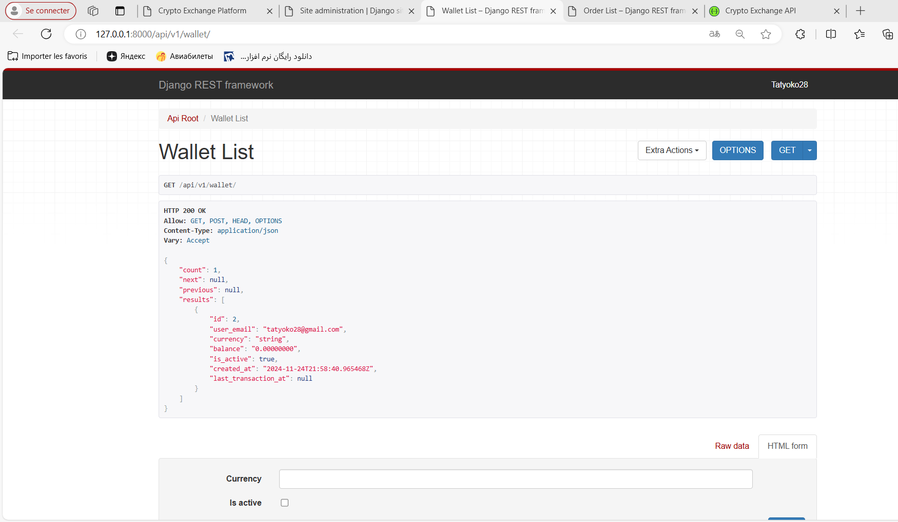
    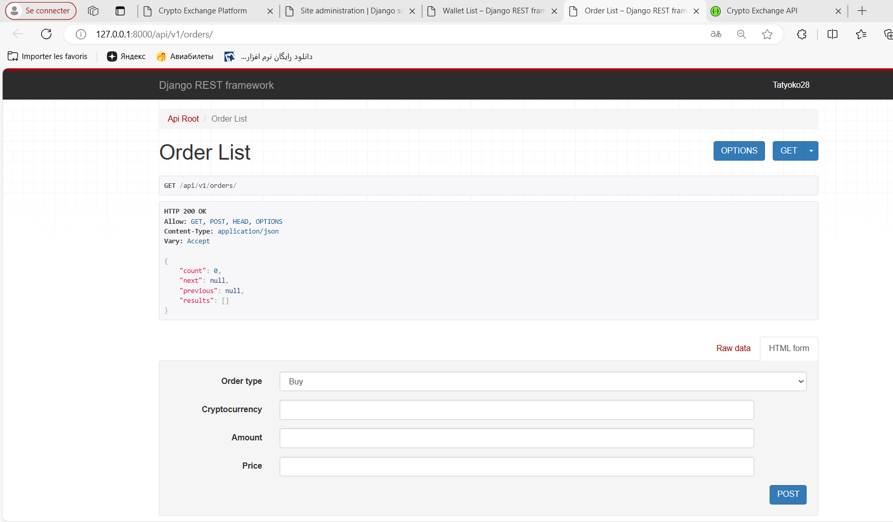
    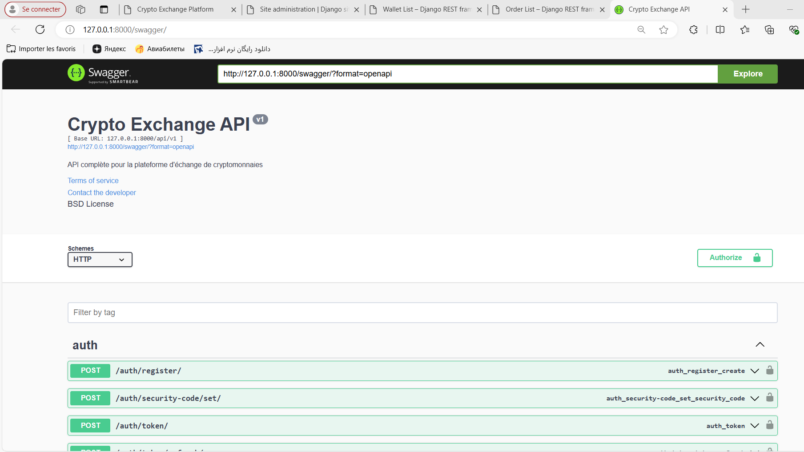
    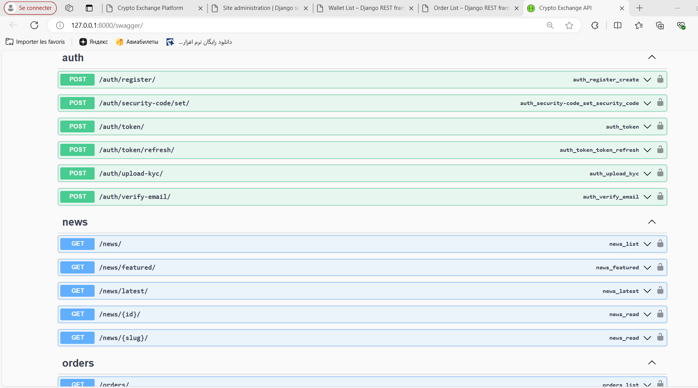
    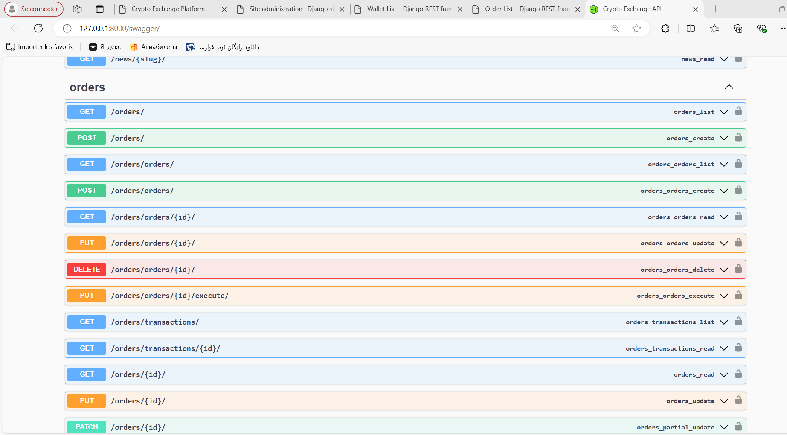
    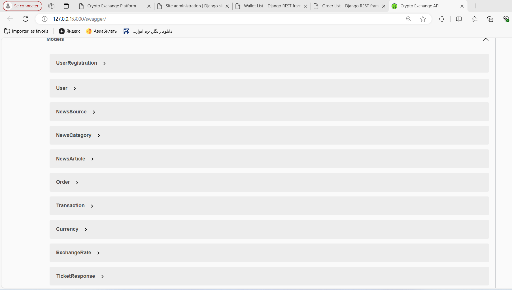
    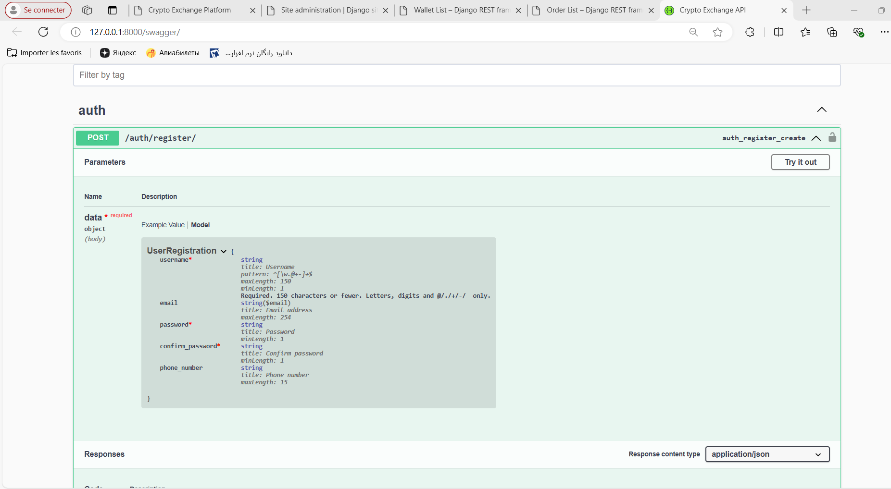
    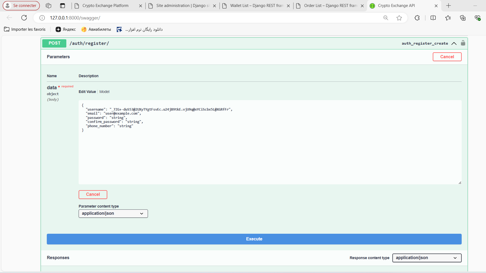
    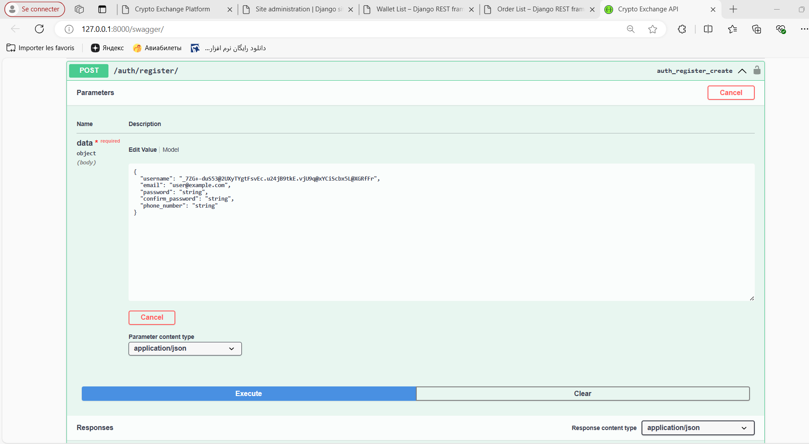
    
    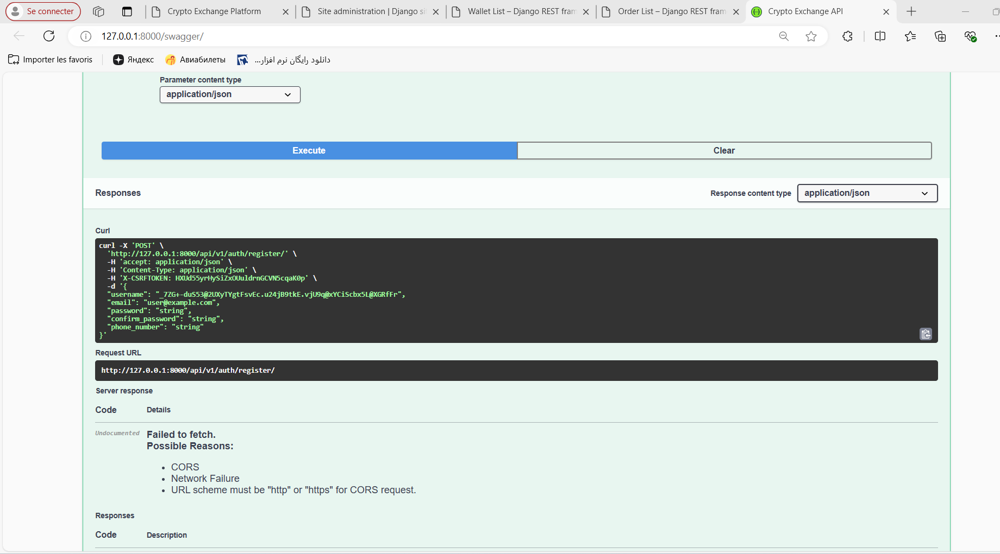
    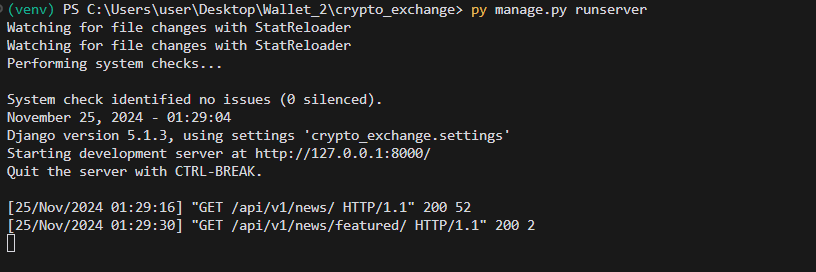
    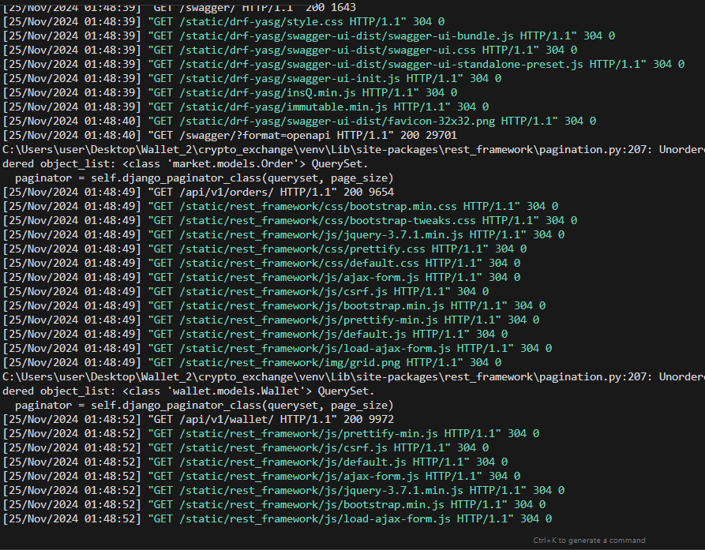
  </div>
</div>

<style>
/* Responsive grid layout */
.screenshot-grid {
  /* Mobile: 1 column */
  grid-template-columns: 1fr;
}

/* Tablet: 2 columns */
@media (min-width: 768px) {
  .screenshot-grid {
    grid-template-columns: repeat(2, 1fr);
  }
}

/* Small desktop: 3 columns */
@media (min-width: 1024px) {
  .screenshot-grid {
    grid-template-columns: repeat(3, 1fr);
  }
}

/* Large desktop: 4 columns */
@media (min-width: 1400px) {
  .screenshot-grid {
    grid-template-columns: repeat(4, 1fr);
  }
}
</style>

---

## Environment Configuration

The project uses two different configuration files depending on the execution mode:

### For Local Development (py manage.py runserver)
1. Ensure PostgreSQL is running locally on your machine
2. Copy `.env.local` to `.env`:
   ```bash
   cp .env.local .env
   ```
   This configuration uses:
   - POSTGRES_HOST=localhost
   - REDIS_URL=redis://localhost:6379/0

### For Docker Development (docker-compose up)
1. Copy `.env.docker` to `.env`:
   ```bash
   cp .env.docker .env
   ```
   This configuration uses:
   - POSTGRES_HOST=db (Docker service name)
   - REDIS_URL=redis://redis:6379/0 (Docker service name)

### Important Notes:
- Never use 'db' as host when running locally with `py manage.py runserver`
- Never use 'localhost' as host when running with Docker
- If you switch between Docker and local development:
  ```bash
  # For local development
  cp .env.local .env
  
  # For Docker
  cp .env.docker .env
  ```

---

## Environment Configuration

The project uses two different configuration files depending on the execution mode:

### For Local Development (py manage.py runserver)
1. Copy `.env.local` to `.env`:
